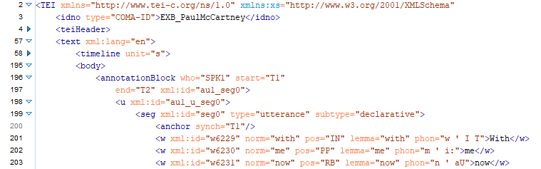

# Transcription+ website

This repo contains the sources for the website of the **Transcription+ project**.

The Transcription+ project is a cooperation of the 
                    <a href="https://www.uni-due.de/kowi/mukom/forschung" target="_blank">University of Duisburg-Essen</a> and the 
                    <a href="https://text-plus.org/" target="_blank">Text+ consortium</a> of the 
                    <a href="https://www.nfdi.de/?lang=en" target="_blank">German National Research Data Infrastructure NFDI</a>.
                    The <a href="https://www.awhamburg.de/" target="_blank">Academy of Sciences and Humanities in Hamburg</a>,
                    the <a href="https://www.fdm.uni-hamburg.de/" target="_blank">Center for Sustainable Research Data Management</a>
                    at the University of Hamburg and 
                    the <a href="https://www.slm.uni-hamburg.de/hzsk.html" target="_blank">Hamburg Center for Language Corpora (HZSK)</a>
                    are partners from the Text+ consortium supporting Transcription+. 

There is nothing but HTML, CSS, PNGs and SVGs in this repo.

The website is currently online at the Academy of Sciences and Humanities in Hamburg:

http://transcription-plus.awhamburg.de/

Feel free to submit issues.

